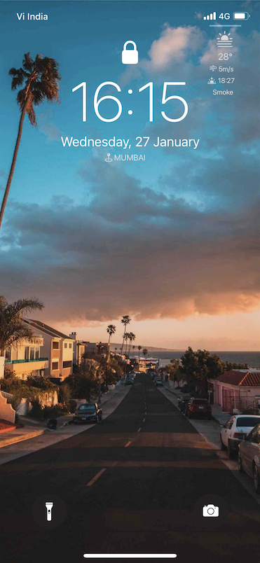
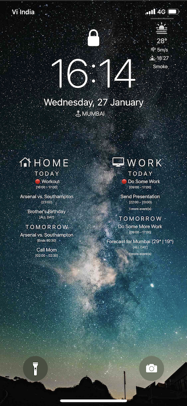
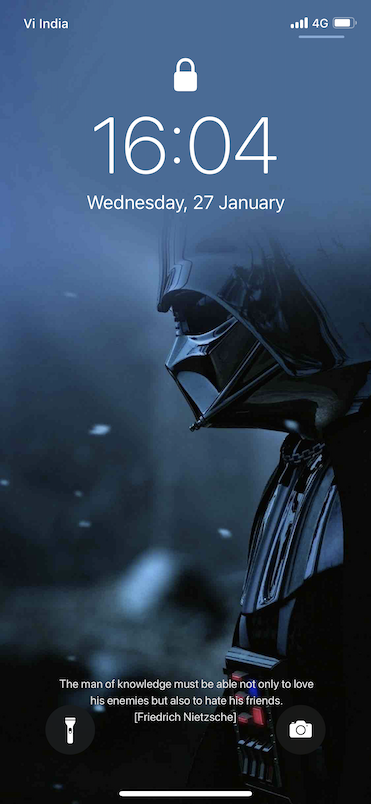
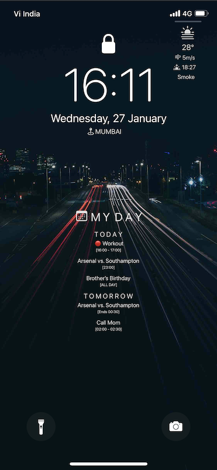

# LSWeather
A Scriptable script to add weather & calendar information on the lock screen. The script is meant to be called from Shortcuts app.
It is fully customizable script giving you access to change each data element on the lock screen.

 
 
 

## Features
1. Shows weather, calendar and random quote on the lock screen.
1. Choose from many pre-defined layouts or create your own layout.
1. Use custom SF symbols for weather icons.
1. Supports multiple calendars and configure 2 separate sections of calendars for *work* and *personal* events.
1. Marked ongoing events for better attention.
1. Fully customisable giving you control of each data element.
   - Easily create new data elements for any of the existing fields.
   - Write custom functions to return data in the format that you need.
1. Supports SF symbols as prefixes. 
   - Learn more about SFSymbols [here](https://developer.apple.com/sf-symbols/).
   - Check full list by downloading the macOS app from the above site or visit [sfsymbols.com](https://sfsymbols.com).
1. Run in *test* mode without calling various APIs

## Installation
1. Download and extract the content of this repository.
1. Download the script `LSWeather.js` to **Scriptable** folder in your iCloud Drive.
```
iCloud Drive/
├─ Scriptable/
│  ├─ LSWeather.js
```
1. Launch Scriptable and make sure that `LSWeather` is listed in the Scripts view.
1. Create an Album in Photos with name **WeatherLS**.
1. Add *some* wallpapers to this Album.
1. Download and install this [shortcut](https://www.icloud.com/shortcuts/698885e96ac5445c9d9125655a90300f).
1. Run the shortcut.

## Script Configuration
1. OpenWeather API
   - Open the script in the Scriptable editor and add your openweather API key at `const WEATHER_API_KEY = `
   - Get your own API key for free [here](https://home.openweathermap.org/api_keys). Account is needed.

1. Template
   - Set `LAYOUT` to one of the predefined values `'welcome'`, `'minimalWeather'`, `'feelMotivated'`, `'mimimalCalendar'`, `'showMyWork'` and `'maximalWeather'`.
   - Or use your customer layout by setting `LAYOUT = 'custom'`.
   
1. Configure Weather Details
   - To show/hide weather details set `WEATHER_SHOW_WEATHER` to `true` or `false`. Hiding weather details will not call the openweather API.
   - To change weather units set `WEATHER_UNITS`. Default is `metric`.
   - To change locale/language set `WEATHER_LANG`. Default is `en`.
   - You can get valid values of `WEATHER_UNITS` & `WEATHER_LANG` [here](https://openweathermap.org/api/one-call-api).

1. Configure Calendar Details
   - To show/hide calendar details set `CALENDAR_SHOW_CALENDARS` to `true` or `false`.
   - To show/hide all day events set `CALENDAR_SHOW_ALL_DAY_EVENTS` to `true` or `false`.
   - To show/hide tomorrow events set `CALENDAR_SHOW_TOMORROW_EVENTS` to `true` or `false`.
   - Set-up personal calendars to be displayed with `CALENDAR_PERSONAL_CALENDARS`.
     - Ex. `const CALENDAR_PERSONAL_CALENDARS = ['Gmail','Football'];`.
     - If this variable is empty (`[]`), script will automatically fetch the default calendar for iOS.
   - Set-up work calendars to be displayed with `CALENDAR_WORK_CALENDARS`.
     - Ex. `const CALENDAR_WORK_CALENDARS = ['Work'];`.
     - If this variable is empty (`[]`), script will not display anything. In this case also set `hide` value to 1 for the layout item `workText` (See details below).
   - Maximum personal events to show set `CALENDAR_PERSONAL_MAX_EVENTS`.
   - Maximum work events to show set `CALENDAR_WORK_MAX_EVENTS`.

1. Configure Quote Details
   - To show/hide quotes set `QUOTE_SHOW_QUOTES` to `true` or `false`. Hiding quotes details will not call the API.
   - Change quote tags with `QUOTE_TAGS` to get quotes for specific categories.
     - Ex. `const QUOTE_TAGS=['wisdom','friendship'].
     - Leave blank to get random quote across all categories.
     - You can get list of all valid tags [here](https://api.quotable.io/tags).
   - To change maximum length of quotes to be fetched set `QUOTE_MAX_LENGTH`.
   - To change quotes wrap length set `QUOTE_WRAP_LENGTH`. 

1. To test the script from Scriptable app i.e. without setting up the shortcut
   - Create a folder **LSWallpapers** in iCloud/Scriptable.
   - Copy a wallpaper file and rename it to **wallpaper.jpg**.
   - The script will create a new wallpaper called **lswallpaper.jpg** in the same location.

1. To test the script without calling the openweather & quotable APIs set `TESTING` to `true`.

1. To change the layout of the data elements update dictionary `layouts`. Checking items which you can change easily to play around with the layout.
   - [ ] source: Source of the data. Valid values are "weather", "calendar", "quote", "text" & "function". 
         When using "function", the key should be the function name and function should return the string to be displayed.
         When using "text", the key should be the text to be displayed.
   - [ ] key: JSON key returned by functions fetchWeather(), fetchCalendar(), fetchQuote(). When the source is "text", key will be displayed as data.
   - [x] prefix: If present, will be prefixed to the data. SFSymbols are allowed in prefix. Use "SFSymbol|symbolName".
   - [x] suffix: If present, will be suffixed to the data. Use "temperature" for temperature data and "speed" for wind data, any other string accepted.
   - [x] x: x co-ordinate of the data element. Valid values are "left_margin", "right_margin", "center" and numbers. You can use relative co-ordinates like "center + 100". 
         Use -ve values to start from right margin i.e -50 will place the element at 50 pixels from the right margin.
   - [x] y: y co-ordinate of the data element. Valid values are "top_margin", "bottom_margin", "center" and numbers. You can use relative co-ordinates like "center + 100". 
   - [x] w: Width of the data element. Valid values are "half", "full" and numbers. You can use relative width like "half - 100".
   - [x] h: Height of the data element. Valid values are "half", "full" and numbers. You can use relative height like "half - 100".
   - [x] font: Font for the data element. Valid values are Font type objects. Predefined fonts are "ultraSmall", "extraSmall", "small", "medium", "large", "veryLarge", "extraLarge", "big" and "veryBig".
   - [x] color: Color for the data element (except icon). Valid values are "light", "dark" or hex code of the color. If null, white will be used.
   - [x] align: Alignment of the data element within the data rectangle. Valid values are "left", "right" or "center".
   - [x] hide: 0 or null to show this data element, 1 to hide, 2 for sunrise/sunset only (to show only 1 of them based on the time of the day).

1. Check script logs in **LSWeatherLogs** folder in iCloud/Scriptable (logs are only saved to file when the script is run from Shortcuts, else logs are displayed on the console).

## APIs Used

1. OpenWeather API - [https://openweathermap.org](https://openweathermap.org).
1. Quotable API - [https://github.com/lukePeavey/quotable](https://github.com/lukePeavey/quotable).

## Credits

Below widgets/scripts have helped while coding for this script.

1. [Futcal for Scriptable](https://github.com/thejosejorge/futcal-for-scriptable).
1. [Terminal Widget](https://github.com/yaylinda/scriptable).
1. [termiWidget](https://gist.github.com/spencerwooo/7955aefc4ffa5bc8ae7c83d85d05e7a4).
1. Thanks to user [schl3ck](https://talk.automators.fm/u/schl3ck) for the code to tint SF symbols in drawContext which is currently not possible in Scriptable.

## Known Issues

1. Sometimes the script fails to complete and also doesn't throw an error. This could be a problem with particular wallpaper or due to insufficient memory. Run the shortcut again or try with different wallpaper.
1. At this point the set-up cannot be completely automated because of iOS restrictions. If anybody is able to figure it out, drop me an email. Would love to see this work.
1. I have added a step in the shortcut to convert the image to lower quality so that the x-callback works properly. While using full quality images, there are more than 50% chances that shortcut will fail. With reduced quality image, it works 100% of the time.